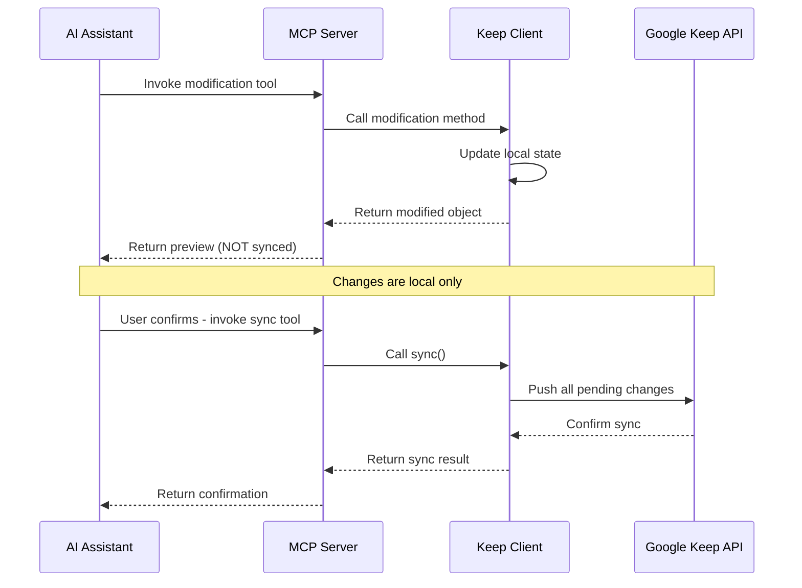

# Design Document - Tier 2 Modifications

## Overview

This design extends the wlater MCP server to support Tier 2 modification operations on Google Keep notes and lists. The implementation maintains the existing read-only architecture while adding controlled write capabilities with explicit user confirmation and manual sync control.

**Key Design Principles:**
- **Safety First**: No automatic syncing - all changes require explicit user confirmation
- **Preview Before Action**: Every modification returns a preview of what changed
- **Explicit Sync**: Separate sync tool that must be manually invoked
- **Error Clarity**: Clear error messages with actionable guidance
- **Backward Compatible**: Existing Tier 1 tools remain unchanged
- **FastMCP Compliant**: Uses modern FastMCP patterns (`@mcp.tool` decorator without parentheses)
- **gkeepapi Compatible**: Follows gkeepapi API patterns for note/list manipulation

## Architecture

### High-Level Flow



### Component Architecture

```
┌─────────────────────────────────────────────────────────┐
│                    MCP Server Layer                      │
│  ┌──────────────┐  ┌──────────────┐  ┌──────────────┐  │
│  │ Tier 1 Tools │  │ Tier 2 Tools │  │  Sync Tool   │  │
│  │  (Read-Only) │  │ (Modify)     │  │              │  │
│  └──────┬───────┘  └──────┬───────┘  └──────┬───────┘  │
└─────────┼──────────────────┼──────────────────┼─────────┘
          │                  │                  │
          └──────────────────┼──────────────────┘
                             │
                    ┌────────▼────────┐
                    │   Keep Client   │
                    │                 │
                    │  - Read methods │
                    │  - Write methods│
                    │  - Sync control │
                    └────────┬────────┘
                             │
                    ┌────────▼────────┐
                    │    gkeepapi     │
                    │  (Google Keep)  │
                    └─────────────────┘
```

## Components and Interfaces

### 1. Keep Client Extensions

Extend `KeepClient` class with modification methods:

```python
class KeepClient:
    # Existing read-only methods...
    
    # List Item Operations
    def update_list_item_checked(
        self, 
        list_id: str, 
        item_id: str, 
        checked: bool
    ) -> Dict[str, Any]:
        """Update checked status of a list item.
        
        Uses: list.items[i].checked = True/False
        """
        
    def add_list_item(
        self, 
        list_id: str, 
        text: str, 
        checked: bool = False,
        sort: int = None
    ) -> Dict[str, Any]:
        """Add new item to existing list.
        
        Uses: list.add(text, checked, sort)
        """
    
    # Note Creation
    def create_note(
        self, 
        title: str = "", 
        text: str = ""
    ) -> Dict[str, Any]:
        """Create new text note.
        
        Uses: keep.createNote(title, text)
        """
    
    def create_list(
        self, 
        title: str = "", 
        items: List[Dict[str, Any]] = None
    ) -> Dict[str, Any]:
        """Create new list with items.
        
        Uses: keep.createList(title, items)
        Items format: [{"text": "item text", "checked": False}, ...]
        """
    
    # Note Updates
    def update_note_title(
        self, 
        note_id: str, 
        title: str
    ) -> Dict[str, Any]:
        """Update note title.
        
        Uses: note.title = "new title"
        """
    
    def update_note_text(
        self, 
        note_id: str, 
        text: str
    ) -> Dict[str, Any]:
        """Update note text content.
        
        Uses: note.text = "new text"
        Note: Only works on Note type, not List type
        """
    
    # Note Properties
    def update_note_color(
        self, 
        note_id: str, 
        color: str
    ) -> Dict[str, Any]:
        """Update note color.
        
        Uses: note.color = gkeepapi.node.ColorValue.<COLOR>
        Valid colors: White, Red, Orange, Yellow, Green, Teal, Blue, 
                     DarkBlue, Purple, Pink, Brown, Gray
        """
    
    def update_note_pinned(
        self, 
        note_id: str, 
        pinned: bool
    ) -> Dict[str, Any]:
        """Pin or unpin note.
        
        Uses: note.pinned = True/False
        """
    
    def update_note_archived(
        self, 
        note_id: str, 
        archived: bool
    ) -> Dict[str, Any]:
        """Archive or unarchive note.
        
        Uses: note.archived = True/False
        """
    
    # Label Operations
    def create_label(
        self, 
        name: str
    ) -> Dict[str, Any]:
        """Create new label.
        
        Uses: keep.createLabel(name)
        """
    
    def add_label_to_note(
        self, 
        note_id: str, 
        label_name: str
    ) -> Dict[str, Any]:
        """Add label to note.
        
        Uses: note.labels.add(label)
        Must find label first with keep.findLabel(label_name)
        """
    
    def remove_label_from_note(
        self, 
        note_id: str, 
        label_name: str
    ) -> Dict[str, Any]:
        """Remove label from note.
        
        Uses: note.labels.remove(label)
        Must find label first with keep.findLabel(label_name)
        """
    
    # Sync Control
    def sync_changes(self) -> Dict[str, Any]:
        """Sync all pending changes to Google Keep."""
    
    def get_pending_changes(self) -> Dict[str, Any]:
        """Get preview of all pending changes."""
    
    def refresh_from_server(self) -> Dict[str, Any]:
        """Refresh local cache from Google Keep."""
    
    # Media Operations (Read-Only)
    def get_note_media(
        self, 
        note_id: str
    ) -> Dict[str, Any]:
        """Get all media attachments from a note.
        
        Uses: note.images, note.drawings, note.audio
        Returns metadata for all media blobs
        """
    
    def get_media_link(
        self, 
        note_id: str,
        blob_id: str
    ) -> Dict[str, Any]:
        """Get download URL for a media blob.
        
        Uses: keep.getMediaLink(blob)
        Returns canonical URL for downloading media
        """
```

### 2. MCP Tool Definitions

New tools to expose in `server.py` using FastMCP's `@mcp.tool` decorator (no parentheses):

```python
# List Item Operations
@mcp.tool
def update_list_item_checked(
    list_id: str, 
    item_id: str, 
    checked: bool
) -> Dict[str, Any]:
    """Update checked status of a list item (requires sync).
    
    Changes are made locally and must be synced with sync_changes().
    """

@mcp.tool
def add_list_item(
    list_id: str, 
    text: str, 
    checked: bool = False,
    sort: int = None
) -> Dict[str, Any]:
    """Add new item to existing list (requires sync).
    
    Changes are made locally and must be synced with sync_changes().
    """

# Note Creation
@mcp.tool
def create_note(
    title: str = "", 
    text: str = ""
) -> Dict[str, Any]:
    """Create new text note (requires sync).
    
    Creates a new note locally. Must call sync_changes() to save to Google Keep.
    """

@mcp.tool
def create_list(
    title: str = "", 
    items: List[Dict[str, Any]] = None
) -> Dict[str, Any]:
    """Create new list with items (requires sync).
    
    Items format: [{"text": "item text", "checked": False}, ...]
    Must call sync_changes() to save to Google Keep.
    """

# Note Updates
@mcp.tool
def update_note_title(
    note_id: str, 
    title: str
) -> Dict[str, Any]:
    """Update note title (requires sync)."""

@mcp.tool
def update_note_text(
    note_id: str, 
    text: str
) -> Dict[str, Any]:
    """Update note text content (requires sync)."""

# Note Properties
@mcp.tool
def update_note_color(
    note_id: str, 
    color: str
) -> Dict[str, Any]:
    """Update note color (requires sync)."""

@mcp.tool
def update_note_pinned(
    note_id: str, 
    pinned: bool
) -> Dict[str, Any]:
    """Pin or unpin note (requires sync)."""

@mcp.tool
def update_note_archived(
    note_id: str, 
    archived: bool
) -> Dict[str, Any]:
    """Archive or unarchive note (requires sync)."""

# Label Operations
@mcp.tool
def create_label(name: str) -> Dict[str, Any]:
    """Create new label (requires sync)."""

@mcp.tool
def add_label_to_note(
    note_id: str, 
    label_name: str
) -> Dict[str, Any]:
    """Add label to note (requires sync)."""

@mcp.tool
def remove_label_from_note(
    note_id: str, 
    label_name: str
) -> Dict[str, Any]:
    """Remove label from note (requires sync)."""

# Sync Control
@mcp.tool
def sync_changes() -> Dict[str, Any]:
    """Sync all pending changes to Google Keep.
    
    Pushes all local modifications to Google Keep servers.
    This is the ONLY way changes are saved.
    """

@mcp.tool
def get_pending_changes() -> Dict[str, Any]:
    """Get preview of all pending changes before syncing.
    
    Shows what will be synced when sync_changes() is called.
    """

@mcp.tool
def refresh_notes() -> Dict[str, Any]:
    """Refresh local cache from Google Keep server.
    
    Fetches latest data from Google Keep. If there are pending local
    changes, they will be synced during this operation.
    """

# Media Operations (Read-Only)
@mcp.tool
def get_note_media(note_id: str) -> Dict[str, Any]:
    """Get all media attachments from a note (read-only).
    
    Returns metadata for images, drawings, and audio clips.
    """

@mcp.tool
def get_media_link(note_id: str, blob_id: str) -> Dict[str, Any]:
    """Get download URL for a media blob (read-only).
    
    Returns canonical URL for downloading the media file.
    """
```

## Data Models

### Preview Response Format

All modification tools return a preview in this format:

```python
{
    "success": True,
    "operation": "update_list_item_checked",
    "preview": {
        "list_id": "abc123",
        "list_title": "Shopping List",
        "item_id": "item456",
        "item_text": "Buy milk",
        "old_value": False,
        "new_value": True
    },
    "synced": False,
    "message": "Item checked status updated locally. Call sync_changes() to save to Google Keep."
}
```

### Sync Response Format

```python
{
    "success": True,
    "operation": "sync",
    "changes_synced": 3,
    "timestamp": "2025-11-14T12:34:56.789Z",
    "message": "Successfully synced 3 changes to Google Keep"
}
```

### Pending Changes Format

```python
{
    "has_changes": True,
    "change_count": 3,
    "changes": [
        {
            "note_id": "abc123",
            "note_title": "Shopping List",
            "change_type": "list_item_checked",
            "details": "Checked: Buy milk"
        },
        {
            "note_id": "def456",
            "note_title": "Ideas",
            "change_type": "note_created",
            "details": "New note created"
        },
        {
            "note_id": "ghi789",
            "note_title": "Meeting Notes",
            "change_type": "note_title_updated",
            "details": "Old: 'Meeting' → New: 'Meeting Notes'"
        }
    ]
}
```

### Error Response Format

```python
{
    "success": False,
    "error": "ValueError",
    "message": "Note abc123 not found",
    "suggestion": "Use list_all_notes() to see available notes"
}
```

### Media Response Formats

**Get Note Media Response:**

```python
{
    "success": True,
    "note_id": "abc123",
    "note_title": "Vacation Photos",
    "media": {
        "images": [
            {
                "blob_id": "img_001",
                "type": "image",
                "width": 1920,
                "height": 1080,
                "byte_size": 245678,
                "extracted_text": "Beach sunset"
            }
        ],
        "drawings": [
            {
                "blob_id": "draw_001",
                "type": "drawing",
                "extracted_text": "Diagram of process"
            }
        ],
        "audio": [
            {
                "blob_id": "audio_001",
                "type": "audio",
                "length": 120.5
            }
        ]
    },
    "total_media": 3
}
```

**Get Media Link Response:**

```python
{
    "success": True,
    "note_id": "abc123",
    "blob_id": "img_001",
    "media_type": "image",
    "download_url": "https://keep.google.com/media/v2/...",
    "expires": "URL is temporary and may expire"
}
```

## Error Handling

### Error Categories

1. **Validation Errors**: Invalid input parameters
   - Invalid color names
   - Empty required fields
   - Invalid note/list/item IDs

2. **Not Found Errors**: Resource doesn't exist
   - Note ID not found
   - List ID not found
   - Item ID not found
   - Label not found

3. **Type Errors**: Wrong note type for operation
   - Attempting to update text on a List
   - Attempting to add items to a Note

4. **API Errors**: Google Keep API failures
   - Authentication failures
   - Network errors
   - Sync failures

### Error Handling Strategy

```python
def update_note_text(self, note_id: str, text: str) -> Dict[str, Any]:
    """Update note text with comprehensive error handling."""
    try:
        note = self.keep.get(note_id)
        
        if note is None:
            raise ValueError(f"Note {note_id} not found")
        
        if isinstance(note, gkeepapi.node.List):
            raise TypeError(
                f"Note {note_id} is a List type. "
                "Lists do not support text updates. "
                "Use add_list_item() instead."
            )
        
        old_text = note.text
        note.text = text
        
        return {
            "success": True,
            "operation": "update_note_text",
            "preview": {
                "note_id": note_id,
                "note_title": note.title,
                "old_text": old_text,
                "new_text": text
            },
            "synced": False,
            "message": "Note text updated locally. Call sync_changes() to save."
        }
        
    except ValueError as e:
        return {
            "success": False,
            "error": "ValueError",
            "message": str(e),
            "suggestion": "Use list_all_notes() to see available notes"
        }
    except TypeError as e:
        return {
            "success": False,
            "error": "TypeError",
            "message": str(e),
            "suggestion": None
        }
    except Exception as e:
        return {
            "success": False,
            "error": type(e).__name__,
            "message": f"Unexpected error: {str(e)}",
            "suggestion": "Check server logs for details"
        }
```

## Testing Strategy

### Unit Tests

Test each Keep Client method in isolation with mocked gkeepapi:

```python
# test_keep_client_modifications.py

def test_update_list_item_checked():
    """Test checking a list item."""
    
def test_add_list_item():
    """Test adding item to list."""
    
def test_create_note():
    """Test creating new note."""
    
def test_create_list():
    """Test creating new list."""
    
def test_update_note_title():
    """Test updating note title."""
    
def test_update_note_text():
    """Test updating note text."""
    
def test_update_note_color():
    """Test changing note color."""
    
def test_update_note_pinned():
    """Test pinning/unpinning note."""
    
def test_update_note_archived():
    """Test archiving/unarchiving note."""
    
def test_create_label():
    """Test creating new label."""
    
def test_add_label_to_note():
    """Test adding label to note."""
    
def test_remove_label_from_note():
    """Test removing label from note."""
    
def test_sync_changes():
    """Test syncing changes to server."""
    
def test_get_pending_changes():
    """Test retrieving pending changes."""
    
def test_refresh_from_server():
    """Test refreshing from server."""
```

### Integration Tests

Test MCP tools with real Keep Client:

```python
# test_tier2_integration.py

def test_modify_and_sync_workflow():
    """Test complete modify-preview-sync workflow."""
    
def test_multiple_modifications_before_sync():
    """Test batching multiple changes before sync."""
    
def test_error_handling_invalid_note_id():
    """Test error handling for invalid IDs."""
    
def test_refresh_after_external_changes():
    """Test refresh tool updates local cache."""
```

### Manual Testing Checklist

- [ ] Create note and verify in Google Keep UI
- [ ] Create list with items and verify in UI
- [ ] Check/uncheck list items and verify in UI
- [ ] Update note title and verify in UI
- [ ] Update note text and verify in UI
- [ ] Change note color and verify in UI
- [ ] Pin/unpin note and verify in UI
- [ ] Archive/unarchive note and verify in UI
- [ ] Create label and verify in UI
- [ ] Add label to note and verify in UI
- [ ] Remove label from note and verify in UI
- [ ] Make multiple changes, preview, then sync
- [ ] Test error messages for invalid inputs
- [ ] Test refresh after creating note in UI

## Security Considerations

### No Automatic Sync

- All modification methods update local state only
- `keep.sync()` is NEVER called automatically
- User must explicitly invoke `sync_changes()` tool
- This prevents accidental data modification

### Preview Before Commit

- Every modification returns a preview
- Preview shows old and new values
- User can review before syncing
- `get_pending_changes()` shows all pending modifications

### Read-Only Credentials

- No changes to credential management
- Same authentication flow as Tier 1
- Master token remains in OS keyring
- No additional permissions required

### Audit Trail

- Log all modification operations
- Log sync operations with timestamps
- Include operation type and affected resources
- Helps debug issues and track changes

## Performance Considerations

### Lazy Sync

- Changes accumulate locally
- Single sync operation for multiple changes
- Reduces API calls to Google Keep
- Improves responsiveness

### Caching Strategy

- Keep Client maintains local cache
- Modifications update cache immediately
- Sync pushes cache to server
- Refresh pulls latest from server

### Batch Operations

- Multiple modifications before sync
- Efficient for bulk updates
- Single network round-trip
- Better user experience

## Migration Path

### Phase 1: Core Infrastructure
- Extend Keep Client with modification methods
- Add preview response formatting
- Implement error handling patterns

### Phase 2: List Operations
- Implement `update_list_item_checked()`
- Implement `add_list_item()`
- Add MCP tools for list operations

### Phase 3: Note Creation
- Implement `create_note()`
- Implement `create_list()`
- Add MCP tools for note creation

### Phase 4: Note Updates
- Implement note property updates (title, text, color, pinned, archived)
- Add MCP tools for note updates

### Phase 5: Label Management
- Implement label operations
- Add MCP tools for labels

### Phase 6: Sync Control
- Implement `sync_changes()`
- Implement `get_pending_changes()`
- Implement `refresh_from_server()`
- Add MCP tools for sync control

### Phase 7: Media Access
- Implement `get_note_media()`
- Implement `get_media_link()`
- Add MCP tools for media operations

### Phase 8: Testing & Documentation
- Write comprehensive tests
- Update README with Tier 2 capabilities
- Create usage examples
- Document safety guidelines

## Future Enhancements

### Potential Tier 2.5 Features

- **Undo/Rollback**: Cache previous state before sync
- **Dry Run Mode**: Preview sync without committing
- **Change Validation**: Validate changes before sync
- **Conflict Resolution**: Handle conflicts with server state
- **Batch Import**: Import multiple notes from JSON/CSV
- **Template System**: Create notes from templates

### Not Included (Tier 3)

- Delete operations (notes, lists, items, labels)
- Trash operations
- Permanent deletion
- Account-level changes
