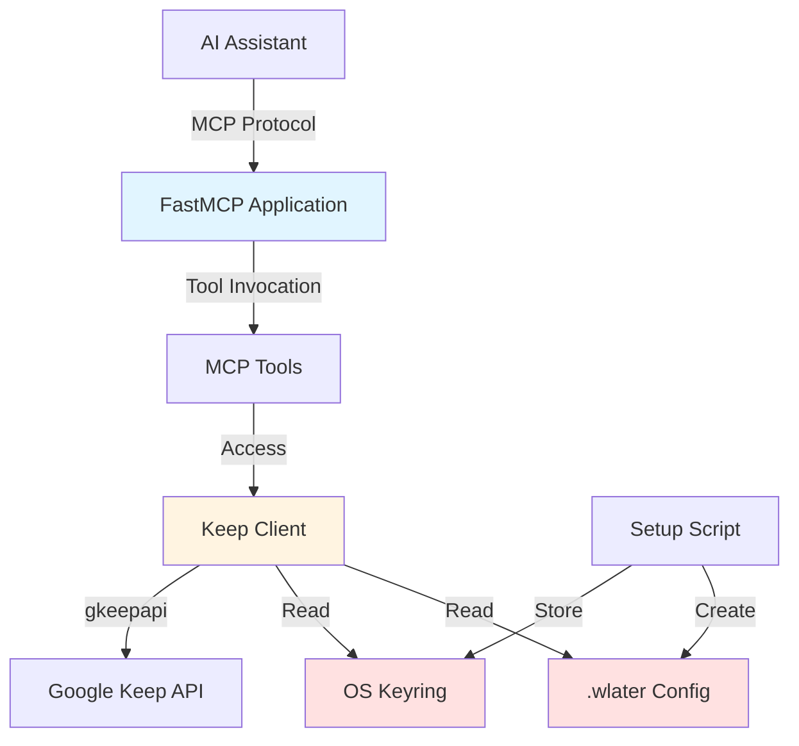

# Design Document

## Overview

The wlater MCP server is a Python application built with FastMCP that provides read-only access to Google Keep notes and lists. The architecture follows a layered approach with clear separation between credential management, Keep API interaction, and MCP tool exposure. The server uses OS-native keyring storage for sensitive credentials and a local JSON config file for non-sensitive settings.

### Key Design Principles

- **Security First**: Master tokens stored in OS keyring, never in plaintext files
- **Read-Only Operations**: No tools expose write, update, or delete capabilities
- **Fail-Safe**: Graceful error handling with clear user guidance
- **Simplicity**: FastMCP handles MCP protocol complexity, allowing focus on business logic
- **Cross-Platform**: Support for Windows, macOS, and Linux credential storage

## Architecture

### High-Level Architecture



### Component Layers

1. **MCP Protocol Layer**: FastMCP handles stdio transport and protocol implementation
2. **Tool Layer**: Decorated Python functions exposing Keep operations
3. **Client Layer**: Keep Client manages authentication and gkeepapi interaction
4. **Storage Layer**: Keyring and config file for credential/configuration persistence

## Components and Interfaces

### 1. FastMCP Application (`src/server.py`)

**Responsibility**: Initialize and run the MCP server with registered tools

**Key Elements**:
- FastMCP instance named "wlater"
- Tool registration via `@mcp.tool` decorator (no parentheses - preferred FastMCP 2.7+ syntax)
- Lazy Keep Client initialization on first tool use
- Module-level state for Keep Client persistence

**Interface**:
```python
from fastmcp import FastMCP

mcp = FastMCP("wlater")

# Module-level state for Keep Client (persists across tool calls)
_keep_client = None

def get_keep_client():
    """Lazy initialization of Keep Client on first use."""
    global _keep_client
    if _keep_client is None:
        email, token, android_id = load_credentials()
        _keep_client = KeepClient(email, token, android_id)
    return _keep_client

@mcp.tool
def list_all_notes() -> list:
    """List all notes and lists from Google Keep (read-only)."""
    keep_client = get_keep_client()
    return keep_client.get_all_notes()

if __name__ == "__main__":
    mcp.run()
```

### 2. Keep Client (`src/keep_client.py`)

**Responsibility**: Manage Google Keep authentication and provide a clean interface to gkeepapi

**Key Methods**:
- `__init__(email, master_token, android_id)`: Initialize and authenticate using `keep.resume()`
- `get_all_notes()`: Retrieve all non-trashed notes
- `get_note(note_id)`: Get specific note by ID
- `get_list_items(list_id)`: Get list items with checked status
- `search_notes(query, filters)`: Search with filters
- `get_labels()`: List all labels
- `find_label(name)`: Find label by name

**Interface**:
```python
import gkeepapi
import logging

logger = logging.getLogger("wlater")

class KeepClient:
    def __init__(self, email: str, master_token: str, android_id: str):
        """Authenticate with Google Keep using stored master token."""
        self.keep = gkeepapi.Keep()
        
        # Authenticate using resume (no password needed)
        success = self.keep.resume(email, master_token, device_id=android_id)
        
        if not success:
            raise RuntimeError("Authentication failed. Token may be expired. Re-run selenium_get_oauth.py")
        
        # Initial sync to load notes
        self.keep.sync()
        logger.info(f"Authenticated as {email}")
    
    def get_all_notes(self, limit: int = 1000) -> list:
        # Return serialized notes
        pass
```

### 3. Credential Manager (`src/credentials.py`)

**Responsibility**: Handle keyring and config file operations

**Key Functions**:
- `store_credentials(email, master_token, android_id)`: Store in keyring and config
- `load_credentials()`: Load from keyring and config
- `validate_master_token(token)`: Check token format (starts with `aas_et/`)
- `validate_android_id(android_id)`: Check 16-char hex format
- `generate_android_id()`: Create deterministic Android ID using reversible base-36 encoding
- `encode_base36_to_hex(s)`: Convert 6-char base-36 string to 8-char hex
- `get_config_path()`: Return path to ~/.wlater

**Interface**:
```python
import keyring
import json
from pathlib import Path

SERVICE_NAME = "google-keep-token"  # Keyring service name

def store_credentials(email: str, master_token: str, android_id: str):
    # Store token in OS keyring
    keyring.set_password(SERVICE_NAME, email, master_token)
    
    # Store non-sensitive config in ~/.wlater
    config = {
        "email": email,
        "android_id": android_id,
        "android_id_platform": platform.system(),
        "android_id_username": getpass.getuser(),
        "last_sync": None,
        "preferences": {}
    }
    config_path = Path.home() / ".wlater"
    config_path.write_text(json.dumps(config, indent=2))

def load_credentials() -> tuple:
    # Load config file to get email
    config_path = Path.home() / ".wlater"
    config = json.loads(config_path.read_text())
    email = config["email"]
    android_id = config["android_id"]
    
    # Check if platform or username changed (requires android_id regeneration)
    current_platform = platform.system()
    current_username = getpass.getuser()
    
    if (config.get("android_id_platform") != current_platform or 
        config.get("android_id_username") != current_username):
        # Regenerate android_id using deterministic algorithm
        android_id = generate_android_id()
        config["android_id"] = android_id
        config["android_id_platform"] = current_platform
        config["android_id_username"] = current_username
        config_path.write_text(json.dumps(config, indent=2))
    
    # Retrieve master token from keyring
    master_token = keyring.get_password(SERVICE_NAME, email)
    
    if not master_token:
        raise ValueError("Master token not found in keyring")
    
    return (email, master_token, android_id)

def generate_android_id() -> str:
    """Generate reversible Android ID using base-36 encoding.
    
    Structure: 776c61 (wlater) + platform_code + encoded_username
    Total: 16 hexadecimal characters
    
    Algorithm:
    1. App prefix: "776c61" (hex for "wlater")
    2. Platform code: 01=Windows, 02=Linux, 03=Darwin, etc.
    3. Username encoding:
       - Get system username
       - Normalize: lowercase, alphanumeric only, first 6 chars, pad with '0'
       - Encode to hex using base-36 to integer conversion
    
    Returns deterministic ID that can be decoded for breach investigation.
    See Docs/android_id_proposal.md for full specification.
    """
    app_prefix = "776c61"
    
    # Platform detection
    PLATFORM_CODES = {
        'Windows': '01', 'Linux': '02', 'Darwin': '03',
        'Java': '04', 'FreeBSD': '05', 'OpenBSD': '06',
        'NetBSD': '07', 'SunOS': '08', 'AIX': '09', 'HP-UX': '0a'
    }
    platform_code = PLATFORM_CODES.get(platform.system(), '00')
    
    # Username normalization
    username = getpass.getuser()[:8].lower()
    normalized = ''.join(c for c in username if c.isalnum())[:6]
    normalized = normalized.ljust(6, '0')
    
    # Base-36 to hex encoding
    username_hex = encode_base36_to_hex(normalized)
    
    return app_prefix + platform_code + username_hex

def encode_base36_to_hex(s: str) -> str:
    """Convert 6-char base-36 string to 8-char hex."""
    value = 0
    for ch in s:
        if '0' <= ch <= '9':
            digit = ord(ch) - ord('0')
        elif 'a' <= ch <= 'z':
            digit = ord(ch) - ord('a') + 10
        else:
            raise ValueError("Invalid character")
        value = value * 36 + digit
    return f"{value:08x}"
```

### 4. Setup Script (`src/setup.py`)

**Responsibility**: One-time interactive setup to obtain and store credentials

**Flow**:
1. Offer choice: run selenium auth OR enter credentials manually
2. If selenium: Call `selenium_get_oauth.main()` which runs interactively and returns credentials
3. If manual: Prompt user for email, master_token, and android_id
4. Validate token format (starts with `aas_et/`)
5. Validate android_id format (16 hex chars)
6. Store token in keyring and create `.wlater` config via Credential Manager
7. Display success message with next steps

**Interface**:
```python
def run_setup():
    print("wlater MCP Server Setup")
    print("=" * 60)
    
    choice = input("Get credentials via selenium (s) or enter manually (m)? ")
    
    if choice == 's':
        # Import and run selenium script which returns credentials
        from selenium_get_oauth import run_selenium_auth
        result = run_selenium_auth()
        
        if result is None:
            print("❌ Selenium authentication failed")
            return
        
        email, token, android_id = result
    else:
        # Manual entry
        email = input("Enter your Google email: ")
        token = input("Paste your master token (starts with aas_et/): ")
        android_id = input("Enter your android_id (16 hex chars): ")
    
    if not validate_master_token(token):
        print("Invalid token format. Must start with 'aas_et/'")
        return
    
    if not validate_android_id(android_id):
        print("Invalid android_id. Must be 16 hexadecimal characters")
        return
    
    # Store credentials (creates ~/.wlater file)
    store_credentials(email, token, android_id)
    
    print("✓ Setup complete! Token stored in keyring.")
    print("✓ Config saved to ~/.wlater")
    print("\nNext steps:")
    print("  1. Add MCP server to your Kiro config")
    print("  2. MCP tools will authenticate automatically using stored token")
```

**Helper Module** (`selenium_get_oauth.py`):
- Standalone script that can be run directly OR imported by setup.py
- When run directly: Displays credentials to console (current behavior)
- When imported: Provides `run_selenium_auth()` function that returns (email, master_token, android_id)
- Automates Google login using Selenium WebDriver
- Extracts oauth_token from cookies and exchanges it for master_token using gpsoauth
- Generates android_id locally using deterministic algorithm (platform + username encoding)
- Not an MCP tool - just a user-facing utility script

**Data Sources**:
- **Selenium mode**: 
  - `email`: User input to selenium script
  - `master_token`: Extracted via oauth_token exchange with gpsoauth
  - `android_id`: Generated locally by selenium script using platform + username
- **Manual mode**: User provides all three values
- **Platform/Username**: Retrieved by `store_credentials()` from system for `.wlater` metadata
- **`.wlater` file**: Created by `store_credentials()` in user's home directory

### 5. MCP Tools (`src/tools.py`)

**Responsibility**: Expose Keep operations as MCP tools

**Tools**:
- `check_credentials()`: Verify credentials exist and are valid
- `list_all_notes()`: List all notes with metadata
- `get_note(note_id)`: Get full note details
- `get_list_items(list_id)`: Get list items with checked status
- `search_notes(query, pinned, archived, trashed, colors, labels)`: Search with filters
- `list_labels()`: List all labels
- `find_label(name)`: Find label by name

**Tool Pattern**:
```python
@mcp.tool
def check_credentials() -> dict:
    """Check if credentials are configured and valid."""
    try:
        email, token, android_id = load_credentials()
        return {
            "configured": True,
            "email": email,
            "message": "Credentials found and valid"
        }
    except Exception as e:
        return {
            "configured": False,
            "message": f"Credentials not configured: {e}"
        }

@mcp.tool
def list_all_notes() -> list:
    """List all notes and lists from Google Keep (read-only)."""
    keep_client = get_keep_client()
    return keep_client.get_all_notes()
```

## Data Models

### Android ID Generation Algorithm

The Android ID is a 16-character hexadecimal identifier generated using reversible base-36 encoding. This design allows for deterministic ID generation (same user + platform = same ID) while enabling username recovery during breach investigations.

**Structure**: `776c61` + `XX` + `YYYYYYYY`
- **Position 0-5** (6 chars): `776c61` - "wlater" app identifier (hex encoding)
- **Position 6-7** (2 chars): Platform code (01=Windows, 02=Linux, 03=Darwin/macOS, etc.)
- **Position 8-15** (8 chars): Username encoded using base-36 to hex conversion

**Platform Codes**:
```python
PLATFORM_CODES = {
    'Windows': '01', 'Linux': '02', 'Darwin': '03',
    'Java': '04', 'FreeBSD': '05', 'OpenBSD': '06',
    'NetBSD': '07', 'SunOS': '08', 'AIX': '09', 'HP-UX': '0a'
}
```

**Username Normalization**:
1. Get system username via `getpass.getuser()`
2. Take first 8 characters
3. Convert to lowercase
4. Keep only alphanumeric characters (remove special chars)
5. Truncate to 6 characters
6. Pad with '0' if less than 6 characters

**Base-36 to Hex Encoding**:
- Base-36 alphabet: `0123456789abcdefghijklmnopqrstuvwxyz` (36 symbols)
- Convert 6-char base-36 string to integer: `value = Σ(digit × 36^position)`
- Convert integer to 8-char hexadecimal: `f"{value:08x}"`
- Reversible: can decode hex back to username for breach investigation

**Examples**:
- Windows user "Brian_mK" → `776c61014b5e1f3a` (brianm → 4b5e1f3a)
- Linux user "user123" → `776c6102e6a9b4c1` (user12 → e6a9b4c1)
- macOS user "john" → `776c61032f8a3c5d` (john00 → 2f8a3c5d)

**Security Properties**:
- Deterministic: same username + platform always produces same ID
- Reversible: can decode username from hex segment for breach investigation
- Collision-free: every unique 6-char string maps to unique 8-hex output
- Privacy-conscious: not directly readable without decoding algorithm

See `Docs/android_id_proposal.md` for complete specification and decoding algorithm.

### Config File Schema (`.wlater`)

```json
{
  "email": "user@gmail.com",
  "android_id": "776c61014b5e1f3a",
  "android_id_platform": "Windows",
  "android_id_username": "brian",
  "last_sync": "2024-01-15T10:30:00Z",
  "preferences": {}
}
```

**Fields**:
- `email`: User's Google email address (used for keyring lookup)
- `android_id`: 16-char hex ID generated using base-36 encoding algorithm
- `android_id_platform`: Platform used to generate ID (for change detection)
- `android_id_username`: Username used to generate ID (for change detection)
- `last_sync`: ISO timestamp of last Keep sync (currently unused)
- `preferences`: User preferences object (currently unused)

### Note Response Schema

```json
{
  "note_id": "abc123",
  "title": "My Note",
  "text": "Note content",
  "note_type": "Note",
  "color": "DEFAULT",
  "pinned": false,
  "archived": false,
  "labels": [{"id": "label1", "name": "Work"}],
  "timestamps": {
    "created": "2024-01-01T00:00:00Z",
    "updated": "2024-01-15T10:00:00Z",
    "edited": "2024-01-15T10:00:00Z"
  }
}
```

### List Items Response Schema

```json
{
  "list_id": "xyz789",
  "title": "Shopping List",
  "all_items": [
    {"item_id": "i1", "text": "Milk", "checked": false, "sort": 1},
    {"item_id": "i2", "text": "Bread", "checked": true, "sort": 2}
  ],
  "checked_items": [
    {"item_id": "i2", "text": "Bread", "checked": true, "sort": 2}
  ],
  "unchecked_items": [
    {"item_id": "i1", "text": "Milk", "checked": false, "sort": 1}
  ]
}
```

## Error Handling

### Error Categories

1. **Authentication Errors**
   - Missing credentials
   - Invalid token format
   - Google Keep authentication failure
   - Keyring access denied

2. **Configuration Errors**
   - Missing .wlater file
   - Invalid JSON format
   - Invalid android_id format
   - Platform mismatch requiring regeneration

3. **Runtime Errors**
   - Note not found
   - Network connectivity issues
   - Invalid note type (e.g., requesting list items from a note)
   - API rate limiting

### Error Handling Strategy

**Credential Errors**: Handle gracefully in check_credentials tool
```python
@mcp.tool
def check_credentials() -> dict:
    """Check if credentials are configured and valid."""
    try:
        email, token, android_id = load_credentials()
        return {"configured": True, "email": email}
    except FileNotFoundError:
        return {"configured": False, "message": "Config file not found. Run setup.py first."}
    except keyring.errors.KeyringError:
        return {"configured": False, "message": "Cannot access keyring. Check permissions."}
    except Exception as e:
        return {"configured": False, "message": f"Error: {e}"}
```

**Authentication Errors**: Handle in lazy initialization
```python
def get_keep_client():
    """Lazy initialization with error handling."""
    global _keep_client
    if _keep_client is None:
        try:
            email, token, android_id = load_credentials()
            _keep_client = KeepClient(email, token, android_id)
        except Exception as e:
            raise RuntimeError(f"Authentication failed: {e}. Run check_credentials tool for details.")
    return _keep_client
```

**Tool Errors**: Let FastMCP handle exception formatting
```python
@mcp.tool
def get_note(note_id: str) -> dict:
    """Get detailed content for a specific note by ID (read-only)."""
    keep_client = get_keep_client()
    note = keep_client.keep.get(note_id)
    
    if note is None:
        raise ValueError(f"Note {note_id} not found")
    
    return serialize_note(note)
```

**Logging**: Use Python logging module
```python
import logging

logging.basicConfig(level=logging.INFO)
logger = logging.getLogger("wlater-mcp")

logger.info("Server starting...")
logger.error(f"Authentication failed: {error}")
```

## Testing Strategy

### Unit Tests

**Credential Manager Tests** (`test_credentials.py`):
- Test token validation (valid/invalid formats)
- Test android_id validation (16 hex chars)
- Test android_id generation
- Test config file creation and parsing
- Mock keyring operations

**Keep Client Tests** (`test_keep_client.py`):
- Mock gkeepapi responses
- Test note serialization
- Test list item extraction
- Test search filtering logic
- Test label operations

**Tool Tests** (`test_tools.py`):
- Mock Keep Client in FastMCP context
- Test each tool's response format
- Test error handling for invalid inputs
- Test result limits and truncation

### Integration Tests

**Setup Flow Test** (`test_setup_integration.py`):
- Run setup with test credentials
- Verify keyring storage
- Verify config file creation
- Clean up test artifacts

**Server Startup Test** (`test_server_integration.py`):
- Start server with test credentials
- Verify Keep Client initialization
- Verify tool registration
- Test graceful shutdown

### Manual Testing

1. **Setup Process**: Run setup.py and verify credential storage
2. **Server Startup**: Start server and check logs for successful auth
3. **Tool Invocation**: Use MCP client to invoke each tool
4. **Error Scenarios**: Test with missing credentials, invalid tokens, etc.

## Security Considerations

### Credential Protection

- Master tokens stored in OS keyring only
- Config file contains no sensitive data
- Token validation before storage
- No token logging or error message exposure

### Read-Only Enforcement

- No tools call gkeepapi.sync() to persist changes
- No tools expose create/update/delete operations
- Tool descriptions explicitly state read-only nature
- Code review checklist for new tools

### Platform Security

- Keyring backends use OS-native encryption
- Windows: Credential Locker (DPAPI)
- macOS: Keychain (encrypted)
- Linux: Secret Service (encrypted)

## Dependencies

### Core Dependencies

```
fastmcp>=0.1.0          # MCP server framework
gkeepapi>=1.0.0         # Google Keep API client
keyring>=24.0.0         # OS keyring access
```

### Optional Dependencies

```
selenium>=4.0.0         # For automated token retrieval
```

### Development Dependencies

```
pytest>=7.0.0           # Testing framework
pytest-mock>=3.0.0      # Mocking support
black>=23.0.0           # Code formatting
mypy>=1.0.0             # Type checking
```

## Deployment

### Installation

```bash
# Clone repository (if not already cloned)
git clone https://github.com/user/wlater-mcp.git
cd wlater-mcp

# Activate virtual environment
# Windows:
.venv\Scripts\activate
# Linux/macOS:
source .venv/bin/activate

# Install dependencies
pip install -r requirements.txt

# Run setup
python src/setup.py

# Start server
python src/server.py
```

### MCP Configuration

Add to Kiro's `mcp.json`:
```json
{
  "mcpServers": {
    "wlater": {
      "command": "C:/path/to/wlater-mcp/.venv/Scripts/python.exe",
      "args": ["C:/path/to/wlater-mcp/src/server.py"],
      "disabled": false
    }
  }
}
```

**Note**: Use the full path to the virtual environment's Python executable:
- Windows: `C:/path/to/wlater-mcp/.venv/Scripts/python.exe`
- Linux/macOS: `/path/to/wlater-mcp/.venv/bin/python`

### Troubleshooting

**Authentication Issues**:
- Verify .wlater file exists in home directory
- Check keyring access: `python -c "import keyring; print(keyring.get_keyring())"`
- Re-run `python src/setup.py` to refresh credentials

**Platform Changes**:
- Server auto-detects platform/username changes
- Regenerates android_id automatically
- Updates .wlater file with new values

## Future Enhancements

### Potential Tier 2 Features (Not in Current Scope)

- Create notes and lists
- Update note content
- Archive/unarchive notes
- Add/remove labels
- Check/uncheck list items

### Performance Optimizations

- Cache note list with TTL
- Incremental sync instead of full sync
- Lazy loading for large note content

### Additional Tools

- Get note by title (fuzzy search)
- Export notes to markdown
- Statistics (note count, list completion rate)
